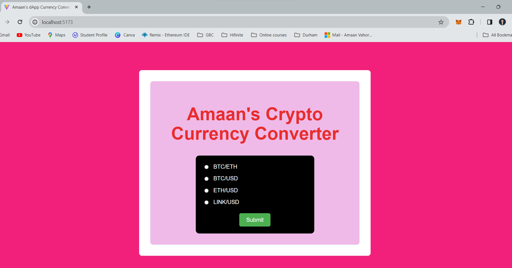

<!-- ABOUT THE PROJECT -->
## About The Project
<h3 align="center">Crypto Currency Converter</h3>

Retrieve the Ethereum market price by referencing this smart contract! 
Finally, a way for smart contracts to get how much $1.00 is in ETH. 
By referencing these contracts you can even automatically convert 
other ERC20's market prices and convert it back into ETH.

This contract doesn't need any calls, all you need to do is reference it and start converting ETH to multiple cryptos. 
All return values are measured in Ethereum's WEI amount, the lowest possible value. You can convert USD, EUR, and even GBP.

```
price = MarketPrice(0x2138FfE292fd0953f7fe2569111246E4DE9ff1DC) // MAINNET ADDRESS
price = MarketPrice(0x97d63Fe27cA359422C10b25206346B9e24A676Ca) // TESTNET ADDRESS (ROPSTEN)
```

## Market Price Update Rate
- MAINNET - Every 2 hours
- TESTNET - Every 15 minutes

Donating to the contract will help support the gas used for updating the exchange prices.

Send ETH to address `0x2138FfE292fd0953f7fe2569111246E4DE9ff1DC` with data: `0xed88c68e` gas limit: `50000`. You can also send ETH or any other ERC20 directly to the contract address. Thank you for donating!

## Market Rate Inside Smart Contract
This contract holds multiple market rates for multiple cryptocurrencies, the contract automatically converts back into ETH value.

### Simple to Use Methods
```
uint256 coin = price.ETH(0);    // returns ETH value for 1 OMG. ETH/OMG
uint256 cent = price.USD(0);    // returns $0.01 worth of ETH in USD.
uint256 cent = price.EUR(0);    // returns $0.01 worth of OMG in Euro.
uint256 cent = price.GBP(0);    // returns $0.01 worth of OMG in British Pound.
```

### Implement in your Contract
First you must include the Pricing Contract on the top of your contract.
```
contract MarketPrice {
    function ETH(uint _id) constant returns (uint256);
    function USD(uint _id) constant returns (uint256);
    function EUR(uint _id) constant returns (uint256);
    function GBP(uint _id) constant returns (uint256);
    function updatedAt(uint _id) constant returns (uint);
}

MarketPrice public price;

function Example() {
  //price = MarketPrice(0x2138FfE292fd0953f7fe2569111246E4DE9ff1DC) // MAINNET ADDRESS
  price = MarketPrice(0x97d63Fe27cA359422C10b25206346B9e24A676Ca) // TESTNET ADDRESS
}

```
Here's an example of getting $5.00 USD worth of ETH valued as USD. 

```
// $0.01 * 500 = $5.00
function FiveUSDinETH() constant returns (uint256) {
    uint256 cents = price.USD(0);
    return cents * 500;
}
```

### Get Market Price Changed Block
```
uint updatedBlock = price.updatedAt(0); // 4,109,482

if (block.number - updatedBlock > 100) {
  // the price hasn't been updated in 100 blocks.
}
```

Once you have the value of $5.00 worth of OMG in ETH, you can have a function to 
require the exact amount of ETH that is worth $5.00 of OMG. 
```
function TradeOMG() constant returns (uint256) {
    require(msg.value == FiveUSDtoOMG());
    // Awesome! The sender sent $5.00 worth of OMG based in ETH value (OMG/ETH)
}
```
<!-- CONTACT -->
## Contact
Your Name - [@twitter_handle](https://twitter.com/axmxxn) - amaanvahora7294@gmail.com
<p align="right">(<a href="#readme-top">back to top</a>)</p>


